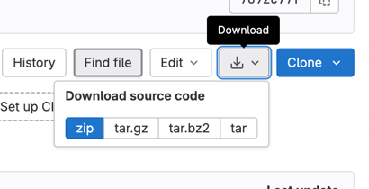
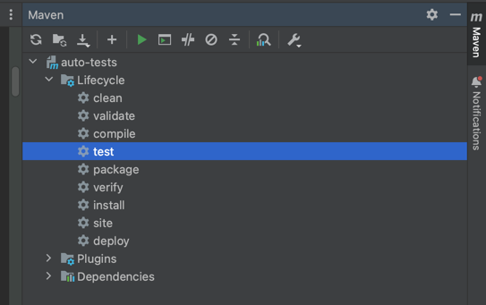
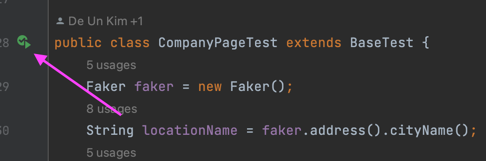
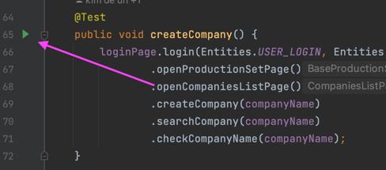

# Introduction
Auto Tests project for Red Flag Security Transit Management Platform. The project contains E2E tests

Autotests are run on the staging1 environment - ***

# Installation
Navigate to the desired directory in the terminal and clone the project using

`git clone https://gitlab.com/***`

or download the archive from gitlab

# Usage
## Tests running
### Tests running with terminal
To run all the tests, use the command

`mvn test`

To run a single test class use

`mvn -Dtest=CompanyPageTest test`

To run a multiple test classes use

`mvn -Dtest=CompanyPageTest,PurchaseOrderPageTest test`

To run a single method use. Before the hash sign is the name of the class, after the hash sign is the name of the method

`mvn -Dtest=PurchaseOrderCreatingTest#createPurchaseOrderWithSpecifiedBuyer test`

### Tests running with IDEA
To run all the tests, use test step in the maven lifecycle

To run a single test class use Run test button

To run a single method use Run test button

## Dependencies 

All dependencies are in the pom file in the dependencies block. When adding a new dependency, specify the version of the library or framework in a separate properties block
## Results

The results are located in the autotests/target/surefire-reports folder. You can also generate a report using allure. To do this, go to the project directory and use the command

`allure serve target/surefire-reports/`

## Creating new tests

### Packages
The project uses the Page object design pattern. Therefore, the description of each page with locators and methods of interacting with them are located in the src/main/java/PageObject folder. The PageObject folder is divided into the corresponding system sets. There are set pages in each set

The tests are located in the src/test/java folder. This folder is also divided into sets and each set contains tests corresponding to the set
### Constants

All constants are located in the src/main/java/constants folder.

- EndPoints file - contains endpoints
- Entities file - contains common constants
- Json file - contains the body of small requests
- URLs file - contains links
- Companies, Country, Locations, OrderStates, PackingTypes, SealStates, TransferStates, UserRoles, UserStates files - contains enums

### Test creating
To create a test, you need to
1. Create a page using the page object pattern
2. Make sure that the created page is in the right folder of the set
3. Make sure that only the locators and methods necessary for tests are located on the page object page
4. Make sure that the tests being created are in the correct folder of the corresponding set
5. Inherit the Base test

---
Read more about git flow, libraries and frameworks, approaches to writing code, checklists, Jenkins at [this link](***)

